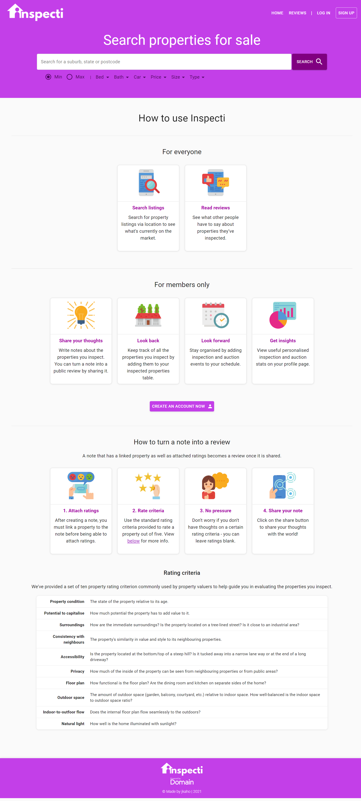
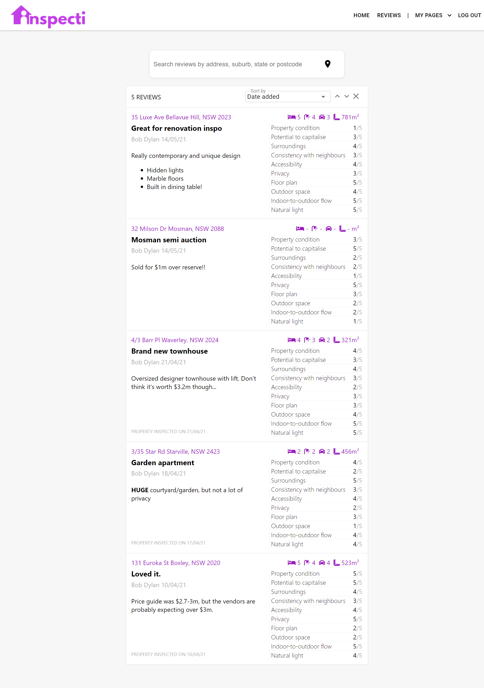
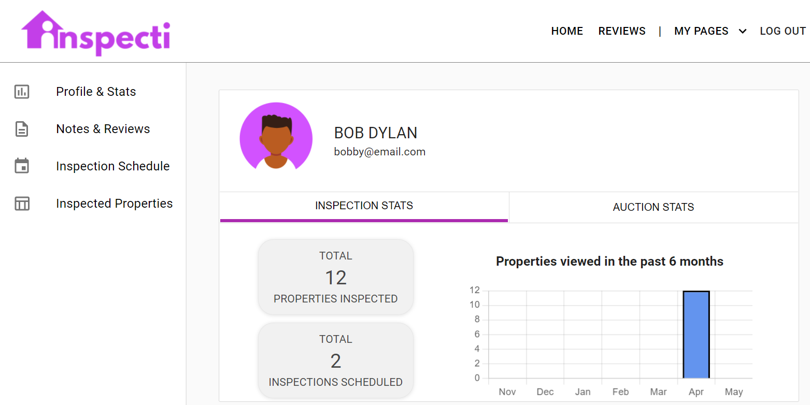
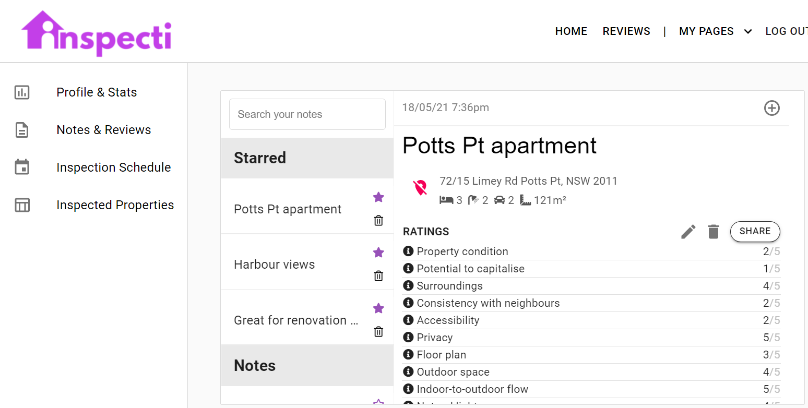
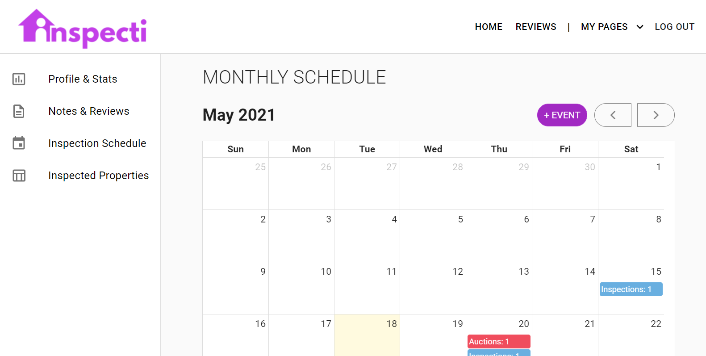
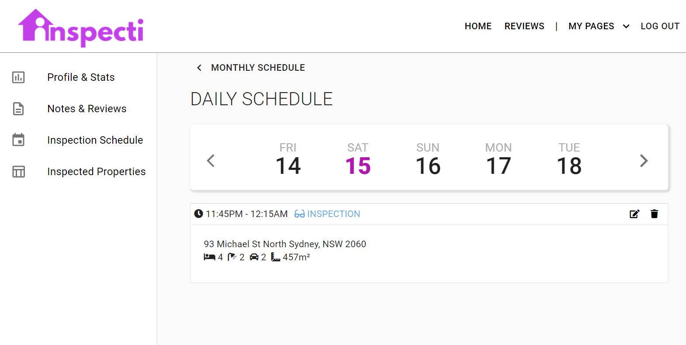
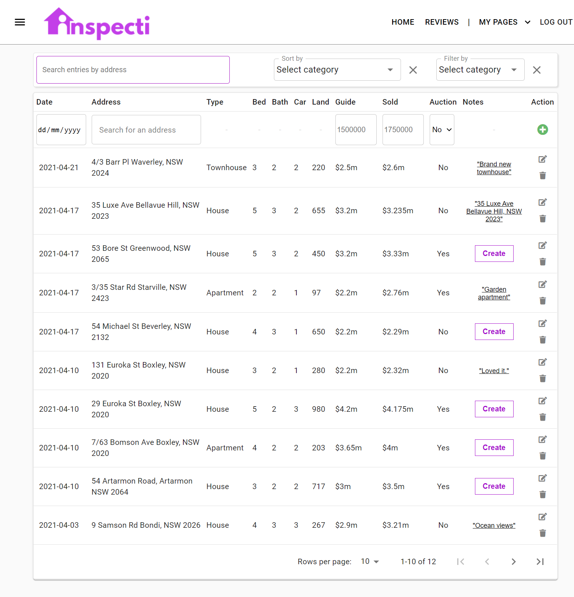

# Inspecti

## Description

*Inspecti* is an Australian residential real estate application to help users keep up with the property market. Users can search for property listings, take notes on properties, rate properties and share reviews, as well as keep track of past and future property inspections. 

## Table of Contents

- [Motivations](#Motivations)
- [What you can do with Inspecti](#What-you-can-do-with-Inspecti)
- [Testing](#Testing)
- [Technologies used](#Technologies-used)
- [Screenshots](#Screenshots)
- [License](#License)
- [Questions](#Questions)

## Motivations

This project was made for real estate enthusiasts and anyone else involved in the real estate market who would benefit from having a platform to keep personal notes and records about properties they've inspected, as well as to be able to view other peoples' opinions about certain properties.

## What you can do with Inspecti

**Everyone can:** 
- Search for property listings
- View property reviews

**Only members can:** 
- Access a personalised profile/stats page
- Use Inspecti's property note-taking functionality
- Keep a schedule of property events (inspections and auctions)
- Keep a table of previously inspected properties

## Testing 

Use the following login credentials for functionality testing purposes: 

- **Email**: `bobby@email.com`
- **Password**: `password`

## Technologies Used

- React / [Create React App](https://reactjs.org/docs/create-a-new-react-app.html) / JSX 
- JavaScript
- [Node.js](https://nodejs.org/en/)
- [Express](https://expressjs.com/)
- SQL / [Sequelize](https://sequelize.org/)
- [Material-UI](https://material-ui.com/)
- [react-draft-wysiwyg](https://www.npmjs.com/package/react-draft-wysiwyg)
- [DOMPurify](https://www.npmjs.com/package/dompurify)
- [Passport.js](http://www.passportjs.org/)
- [bcrypt](https://www.npmjs.com/package/bcrypt) 
- [FullCalendar React](https://www.npmjs.com/package/@fullcalendar/react)
- [Chart.js](https://www.chartjs.org/docs/latest/)
- [number-abbreviate](https://www.npmjs.com/package/number-abbreviate)
- [Canva](https://www.canva.com/)

## Screenshots

### Homepage

### Reviews

### Profile (members only)

### Notes & Reviews (members only)

### Inspection Schedule (members only)

#### Monthly View

#### Daily View

### Inspected Properties (members only)

## License

This application is covered under the MIT license.
For more information, [click here](https://opensource.org/licenses/MIT).

## Questions 

**My GitHub Profile:** [jkaho](https://www.github.com/jkaho/inspecti)

If you have any further questions, feel free to email me at [j.h_7@yahoo.com](j.h_7@yahoo.com)
